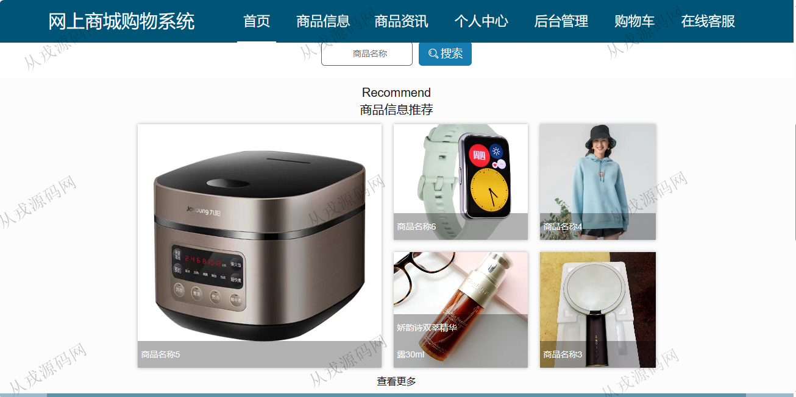
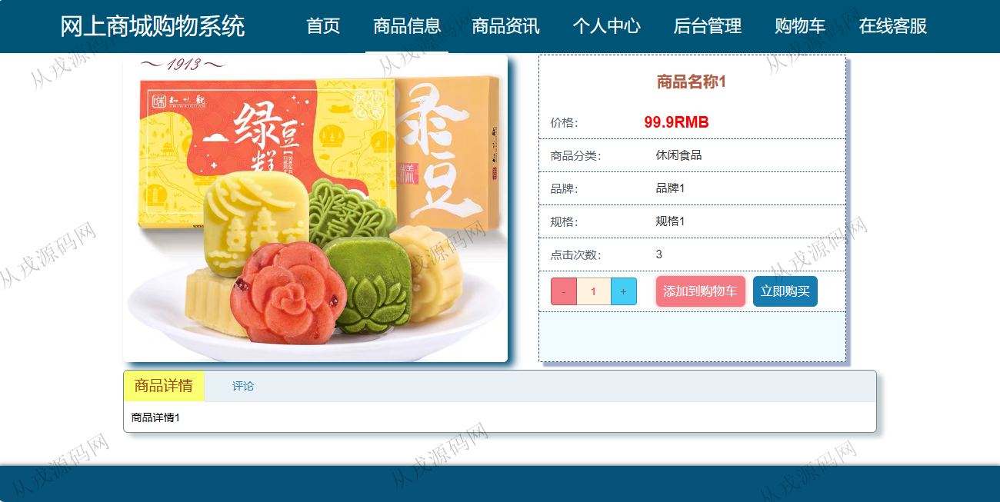
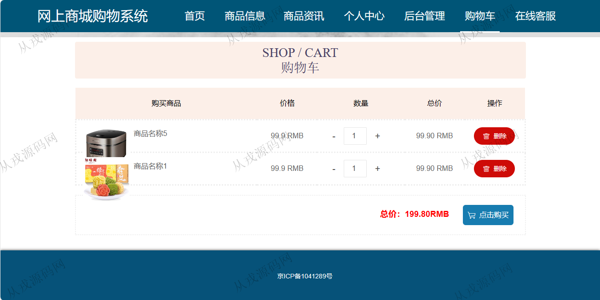
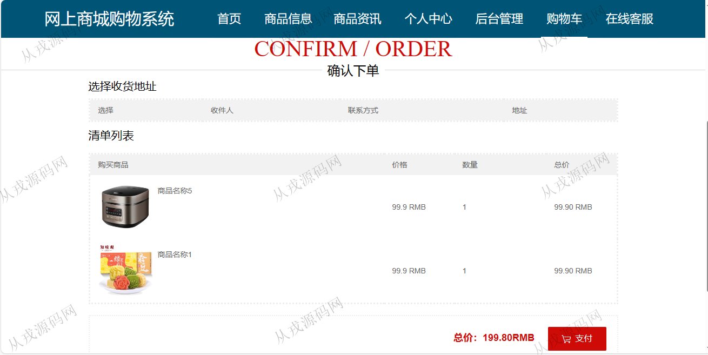
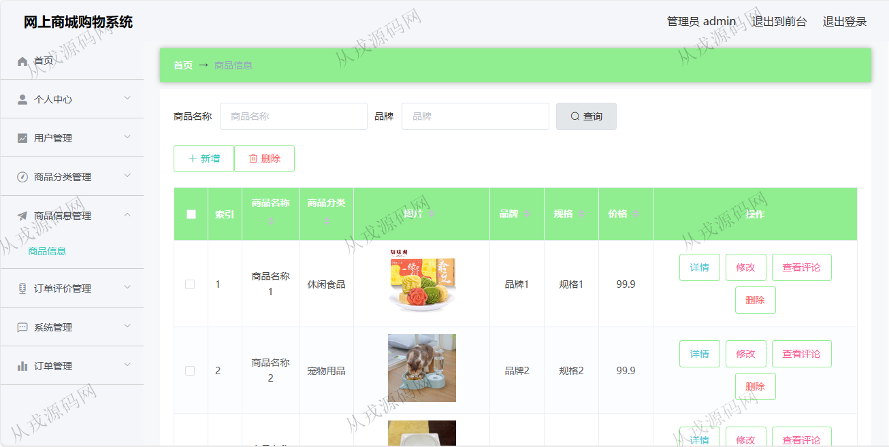
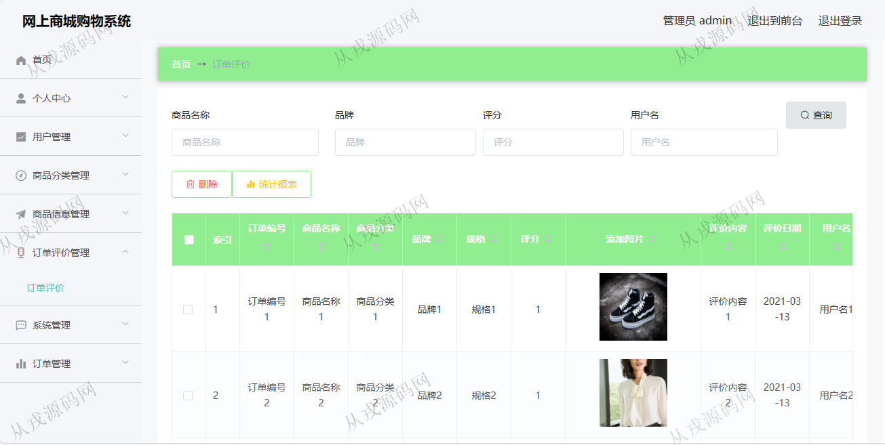

<h1 align="center">138.网上商城购物管理系统</h1>

 获取sql文件 QQ: 386869957 QQ群: 377586148 

 [更多源码项目: 从戎源码网](https://armycodes.com/) 

## 简介

> 本代码来源于网络,仅供学习参考使用!
>
> 提供1.远程部署/2.修改代码/3.设计文档指导/4.框架代码讲解等服务
>
> 用户端访问地址：http://localhost:8080/springboot7z60r/front/index.html
> 
> 用户：user 123456
> 
> 管理后台访问地址：http://localhost:8080/springboot7z60r/admin/dist/index.html#/index
> 
> 管理员：admin 123456
>

## 项目介绍
基于springboot+vue的网上商城购物系统：前端 html、jquery、layui，后端 maven、springmvc、spring、mybatis；角色分为管理员、用户；集成商品购买、商品资讯、订单查询等功能于一体的系统。

## 功能介绍

### 用户

- 基本功能：登录、注册、退出
- 网站首页：轮播图，主导航栏，商品搜索，商品信息推荐、商品资讯
- 商品购买：商品列表展示，商品详情，收藏，评论，商品加入购物车，购物车列表，购物车结算支付
- 商品资讯：资讯信息展示，资讯详情
- 个人中心：个人信息查询与修改，我的订单列表，我的地址信息维护，我的收藏列表

### 管理员

- 用户管理：用户信息的增删改查，同时也可以对前台用户注册信息进行查看和维护
- 商品分类管理：分类信息的增删改查
- 商品管理：商品信息的增删改查，商品图片上传，商品按名称和品牌进行搜索查询
- 订单评价管理：对订单评价信息进行查看与删除
- 订单管理：前台用户下单数据进行查询，已退款订单，已完成订单，已发货订单，未支付订单，已取消订单，已支付订单
- 系统管理：在线客服，轮播图管理，商品资讯信息的增删改查

## 环境

- <b>IntelliJ IDEA 2021.3</b>

- <b>Mysql 5.7.26</b>

- <b>node 14.14.0</b>

- <b>JDK 1.8</b>

## 运行截图

